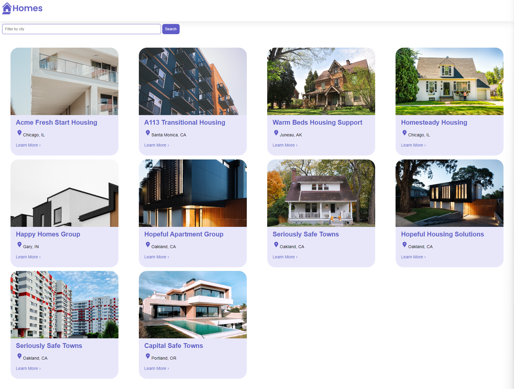

# Angular Homes App

This application was build following [Learning Angular](https://goo.gle/Learning-Angular) series by Angular in YouTube.

The course outcomes:
- Develop an application with the Angular CLI
- Build components and routes
- Use services and make HTTP requests

## Screenshots

Here are some screenshots from the project:

### Homepage

### Search filtering

### Details page

## To run the application

- Install Angular if you don't have it installed

  `npm install -g @angular/cli`

- Install json-server if you don't have it installed

  `npm install -g json-server`

- Clone this branch to your local machine

- Once the code has been downloaded

  `cd angular-homes-app`

- Install the depencies

  `npm install`

- Run the application 

  `ng serve`

- Run the json-server

  `json-server --watch db.json`